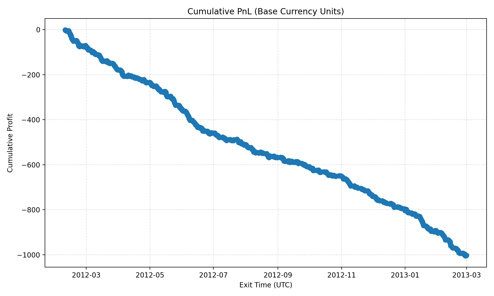

<!--
Copyright 2025 Edward Clewer

Licensed under the Apache License, Version 2.0 (the "License");
you may not use this file except in compliance with the License.
You may obtain a copy of the License at

    http://www.apache.org/licenses/LICENSE-2.0

Unless required by applicable law or agreed to in writing, software
distributed under the License is distributed on an "AS IS" BASIS,
WITHOUT WARRANTIES OR CONDITIONS OF ANY KIND, either express or implied.
See the License for the specific language governing permissions and
limitations under the License.
-->

# Analysis & Reporting

See also: [Quickstart](quickstart.md) · [Metrics Reference](configs/metrics.md) · [Concepts](concepts.md)

Every backtest produces a reproducible bundle under the configured `output_base_path/<RUN_ID>/`. This guide explains the structure and how to interpret the artefacts. Screenshots and snippets in this page originate from seeded Brownian-motion fixtures so you can reproduce them locally.

Path handling is config-relative for `run`: the backtest parser resolves `data_base_path`, `output_base_path`, `metrics_config_path`, and `strategy_config_path` against the directory containing `backtest.yaml`.

## Directory Layout

The `run` command writes the base bundle:

```
<output_base_path>/<RUN_ID>/
├── configs/                  # Snapshots of the YAML files and SHA256 digests
├── environment.txt           # pip freeze output captured at runtime
├── manifest.json             # High-level run metadata
└── output/
    ├── logs/<RUN_ID>.log     # NDJSON structured log
    └── <PAIR>/
        └── trades.parquet    # Trade-level dataset
```

The `report <trades.parquet>` command writes beside the selected trade file:

```
<output_base_path>/<RUN_ID>/output/<PAIR>/
├── trades.parquet
├── trades_report.md
├── trades_equity_curve.png
└── metric_stratification/
    ├── csv/
    ├── graphs/
    └── reports/
```

The `analyze <trades.parquet>` command writes beside the selected trade file:

```
<output_base_path>/<RUN_ID>/output/<PAIR>/
├── trades.parquet
└── multivariate_analysis/
    ├── coefficients.csv
    ├── correlations.csv
    ├── dropped_predictors.csv
    └── summary.md
```

| Artefact | Location | Purpose |
| --- | --- | --- |
| Config snapshots | `configs/*.yaml` | Literal copies of the YAML inputs with SHA256 hashes. |
| Dependency freeze | `environment.txt` | `pip freeze` output captured at runtime for reproducibility. |
| Manifest | `manifest.json` | Run metadata, shard hashes, tick validation summary, and outputs. |
| Structured log | `output/logs/<RUN_ID>.log` | NDJSON event stream covering lifecycle, warnings, and errors. |
| Trades | `output/<PAIR>/trades.parquet` | Row-per-trade dataset (metrics, metadata, PnL). |
| Report bundle | `output/<PAIR>/trades_report.md`, `output/<PAIR>/trades_equity_curve.png`, `output/<PAIR>/metric_stratification/` | Post-run reporting artefacts generated by `tick-backtest report`. |
| Multivariate bundle | `output/<PAIR>/multivariate_analysis/` | Regression-style diagnostics generated by `tick-backtest analyze`. |

## Manifest Highlights

`manifest.json` provides an auditable snapshot:

- `run_id`, `timestamp_utc`, `code_ref` - Identify the exact run and git commit hash.
- `configs` - Original and copied config paths with SHA256 hashes and embedded YAML text.
- `input_shards` - Each referenced Parquet file with row counts, hashes, and error annotations.
- `outputs` - Per-pair trade files with row counts.
- `pair_failures` - Map of pairs that failed validation or execution.
- `tick_validation` - Counters for skipped ticks grouped by issue type.

Use the manifest to confirm data coverage, identify missing shards, and verify that configs were not altered post-run.

```json
{
  "run_id": "20251101215953-dbb12e3d",
  "code_ref": "56e94c0ebc9a9f269e3fe14bfe35fdfbc98fd06d",
  "configs": {
    "backtest": {
      "sha256": "ac87e12dec2d6c547693b60f355779d86e195665ff063e76a1cb8ffc73cbe852",
      "schema_version": "1.0"
    }
  },
  "outputs": [
    {"pair": "EURUSD", "rows": 46773, "path": ".../output/EURUSD/trades.parquet"}
  ],
  "tick_validation": {
    "EURUSD": {
      "total_ticks": 14748428,
      "accepted_ticks": 14748428,
      "skipped_ticks": 0,
      "issues": {}
    }
  }
}
```

## Structured Logs

`output/logs/<RUN_ID>.log` uses NDJSON entries. Useful log types:

- `run metadata snapshot` - Emitted at start; lists active config paths.
- `starting pair backtest` / `completed pair backtest` - Brackets each symbol run.
- `tick validation summary` - Final tallies of accepted/skipped ticks.
- Error entries - Include stack traces and pair names to aid debugging.

Load the log into tools like `jq`, your preferred observability stack, or attach snippets to GitHub issues for richer analysis.

## Trade Dataset (`trades.parquet`)

Columns include:

- `pair`, `direction`, `entry_time`, `exit_time`, `holding_seconds`
- `entry_price`, `exit_price`, `pnl_pips`, `outcome_label`
- Embedded metric snapshots (`metric_name.value`) at entry time
- Signal metadata (`entry_metadata`, `reason`, `timeout_seconds`)

You can create pandas notebooks to recompute KPIs or feed trades into downstream analytics.

## Markdown Report

`trades_report.md` summarises headline metrics:

- Trade counts (win/loss/breakeven)
- Net/Gross PnL in pips, expectancy, profit factor
- Sharpe ratios (per-trade and daily, computed from pip PnL)
- Daily pip PnL mean and standard deviation
- Max drawdown and duration
- Link or inline image to `trades_equity_curve.png`

The report file and equity-curve image are written beside the selected `trades.parquet` file.

Use this as a lightweight performance overview before diving into raw trades.



## Metric Stratification

The report pipeline generates stratification artefacts under `metric_stratification/` beside the selected `trades.parquet` file:

- `csv/<mode>/` - Expectancy tables grouped by metric bins.
- `graphs/<mode>/` - PNG visualisations for quick inspection.
- `reports/metric_report_<mode>.md` - Narrative explanation of metric impact.

The binning modes are derived from the metrics configuration. Disable or extend metrics to tailor these outputs.

## Multivariate Analysis

The `analyze` command writes `multivariate_analysis/` beside the selected `trades.parquet` file:

- `summary.md` - Top-level regression summary.
- `coefficients.csv` - Coefficients sorted by absolute standardized magnitude.
- `correlations.csv` - Correlation matrix for the retained predictors and target.
- `dropped_predictors.csv` - Predictors removed because they were constant or near-perfectly collinear with an earlier retained predictor.

The regression excludes timestamps, execution prices, holding-period columns, and other post-trade or identity-linked fields. It only keeps entry-time numeric predictors such as metric snapshots and `direction`.
It also applies explicit collinearity pruning before fitting so near-duplicate predictors do not dominate the coefficient table.

## Troubleshooting

- **Empty `trades.parquet`** - Check `Warmup` duration and entry predicates; run logs for "no data available" warnings.
- **Missing report artefacts** - Run `tick-backtest report <trades.parquet>`; the base `run` command does not create `trades_report.md`, `trades_equity_curve.png`, or `metric_stratification/`.
- **Missing multivariate artefacts** - Run `tick-backtest analyze <trades.parquet>`; outputs land under `multivariate_analysis/` beside the trade file.
- **Validation Failures** - Inspect `tick_validation` in the manifest to confirm whether bad ticks were skipped or data shards were missing.

See [Quickstart](quickstart.md) for rerunning the pipeline and [Developer Internals](dev/internals.md) for debugging compiled components.
