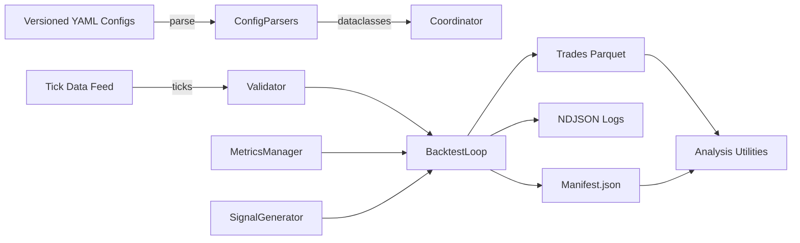

<!--
Copyright 2025 Edward Clewer

Licensed under the Apache License, Version 2.0 (the "License");
you may not use this file except in compliance with the License.
You may obtain a copy of the License at

    http://www.apache.org/licenses/LICENSE-2.0

Unless required by applicable law or agreed to in writing, software
distributed under the License is distributed on an "AS IS" BASIS,
WITHOUT WARRANTIES OR CONDITIONS OF ANY KIND, either express or implied.
See the License for the specific language governing permissions and
limitations under the License.
-->

# Architecture

See also: [Quickstart](quickstart.md) · [Config Overview](configs.md) · [Concepts](concepts.md)

The Tick Backtest Research Stack separates configuration, data ingestion, execution, and analysis so that every run can be reproduced or extended without code changes.

!!! note "Performance & design rationale"
    Tick ingestion is vectorised via PyArrow, yet each pair runs through a sequential signal/backtest loop to avoid lookahead bias. This design still hits ~8 million ticks/minute/core on an AMD 5950X while keeping every run fully auditable through manifests, logs, and environment snapshots.

## High-Level Flow

1. **Configuration Parsing** – YAML files under `config/` are validated and converted into immutable dataclasses (`BacktestConfigParser`, `MetricsConfigParser`, `StrategyConfigParser`).
2. **Data Feed & Validation** – The compiled `DataFeed` streams ticks per month. Every feed is wrapped in a `TickValidator` that enforces monotonic timestamps, finite bid/ask/mid values, and non-negative spreads.
3. **Metrics & Signals** – `MetricsManager` instantiates all enabled metrics and computes rolling indicators. `SignalGenerator` combines entry engines with predicate evaluation to produce open/close instructions.
4. **Backtest Coordinator** – `BacktestCoordinator` iterates each configured pair, manages output directories, and records pair-level failures without aborting the entire batch.
5. **Backtest Loop** – For each tick, metrics update, signals evaluate, positions open/close, and trades append to an in-memory ledger. On completion, trades persist to Parquet.
6. **Artefact Snapshot** – Every run writes a manifest, environment snapshot, logs, and analysis outputs under `output/backtests/<RUN_ID>/`.

## Key Components

| Module | Purpose |
| --- | --- |
| `tick_backtest/backtest/workflow.py` | Entry point that loads configs, prepares output folders, runs backtests, and persists manifests. |
| `tick_backtest/backtest/backtest_coordinator.py` | Coordinates per-pair runs, handles data feed errors gracefully, and tracks tick-validation stats. |
| `tick_backtest/backtest/backtest.py` | Core execution loop handling warmup, tick processing, trade lifecycle, and persistence. |
| `tick_backtest/data_feed/data_feed.py` | Compiled data feed loader with Python fallback. Provides month-by-month tick iterators. |
| `tick_backtest/data_feed/validation.py` | Tick validation, issue tallying, and feed wrappers to skip invalid ticks. |
| `tick_backtest/metrics/manager/metrics_manager.py` | Builds metric instances from config and updates them per tick. |
| `tick_backtest/signals/signal_generator.py` | Wires entry engines and predicates into runtime signals. |
| `tick_backtest/analysis/*` | Reporting utilities that derive Markdown summaries, equity curves, and stratification studies. |

## Resilience & Reproducibility

- **Immutable Outputs** – Each run is isolated to a timestamped directory with config snapshots hashed via SHA256.
- **Failure Isolation** – Pair-level errors (missing data, runtime exceptions) are captured in the manifest and logs; remaining pairs continue.
- **Environment Capture** – `environment.txt` stores the result of `pip freeze` to document dependencies.
- **Tick Validation** – Invalid ticks increment counters and are skipped, keeping the backtest deterministic without aborting.

Refer to [Developer Notes](dev/internals.md) for module dependencies, testing strategy, and extension guidelines.
