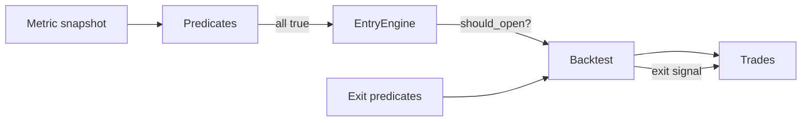

<!--
Copyright 2025 Edward Clewer

Licensed under the Apache License, Version 2.0 (the "License");
you may not use this file except in compliance with the License.
You may obtain a copy of the License at

    http://www.apache.org/licenses/LICENSE-2.0

Unless required by applicable law or agreed to in writing, software
distributed under the License is distributed on an "AS IS" BASIS,
WITHOUT WARRANTIES OR CONDITIONS OF ANY KIND, either express or implied.
See the License for the specific language governing permissions and
limitations under the License.
-->

# Strategy Reference

Strategy files (`config/strategy/*.yaml`) define a single entry engine plus an exit condition composed of predicates. At runtime the parser converts the YAML into `StrategyConfigData`, feeds it to the signal generator, and enriches all generated trades with entry metadata.



```
schema_version: "1.0"
strategy:
  name: threshold_reversion_strategy
  entry:
    name: threshold_reversion_entry
    engine: threshold_reversion
    params: {...}
    predicates: [...]
  exit:
    name: default_exit
    predicates: [...]
```

## Entry Blocks

Every entry block contains:

| Field | Description |
| --- | --- |
| `name` | Free-form label written to trade metadata (e.g., `reason`). |
| `engine` | Identifier resolved via `ENTRY_ENGINE_REGISTRY`. |
| `params` | Mapping validated against the engine’s dataclass. |
| `predicates` | Optional list of predicate definitions. All predicates must pass for the engine to emit an open signal. |

Predicates use the following schema:

| Field | Type | Required | Notes |
| --- | --- | --- | --- |
| `metric` | string | ✅ | Dot-referenced metric key (e.g., `z30m.z_score`). |
| `operator` | string | ✅ | One of `<`, `<=`, `>`, `>=`, `==`, `!=`. |
| `value` | number | ◻️ | Literal RHS. Mutually exclusive with `other_metric`. |
| `other_metric` | string | ◻️ | Metric key to compare against. Mutually exclusive with `value`. |
| `use_abs` | bool | ◻️ | Apply `abs()` to the left-hand side before comparison. Defaults to `false`. |

Missing metrics or non-finite values cause the predicate to evaluate to `false`. Duplicate predicates (same combination of fields) are rejected during parsing.

### `threshold_reversion`

Mean-reversion entry engine driven by the compiled `ThresholdReversionMetric`. Tracks a reference price, waits for deviations beyond `threshold_pips`, and emits long/short signals with TP/SL levels derived from the configured multiples.

| Parameter | Type | Required | Default | Description |
| --- | --- | --- | --- | --- |
| `lookback_seconds` | int | ✅ | – | Horizon for establishing the reference price. |
| `threshold_pips` | float | ✅ | – | Minimum distance from the reference mid required to trigger a signal. |
| `tp_pips` | float | ❌ | `threshold_pips` | Take-profit distance in pips (must be positive). |
| `sl_pips` | float | ❌ | `threshold_pips` | Stop-loss distance in pips (must be positive). |
| `min_recency_seconds` | float | ❌ | `0.0` | Minimum age of the reference before a new trade can open. Helps avoid rapid flip-flops. |
| `trade_timeout_seconds` | float | ❌ | `null` | Optional timeout after which positions auto-close (`TIMEOUT`). |

**Metadata emitted on trade open**
- `direction` (`1` for long, `-1` for short)
- `signal_price`
- `threshold`, `threshold_pips`
- `tp_price`, `sl_price`
- `reference_price`, `reference_age_seconds`
- `position_open_age_seconds`
- `trade_timeout_seconds`

**Behavioural notes**
- The engine prevents back-to-back entries in the same direction until the metric reverts.
- TP/SL are re-derived from the filled entry price if the metric does not supply valid levels.
- Pair-specific `pip_size` (from the backtest config) determines the conversion of pip distances into absolute prices.

Example:

```yaml
entry:
  name: threshold_reversion_entry
  engine: threshold_reversion
  params:
    lookback_seconds: 1800
    threshold_pips: 8
    tp_pips: 8
    sl_pips: 12
    min_recency_seconds: 90
    trade_timeout_seconds: 3600
  predicates:
    - metric: spread_60s.spread_percentile
      operator: "<"
      value: 0.4
    - metric: tick_rate_30s.tick_rate_per_min
      operator: ">"
      value: 80
```

### `ewma_crossover`

Trend-following engine that watches two metrics (typically EWMAs) and fires when the difference changes sign.

| Parameter | Type | Required | Default | Description |
| --- | --- | --- | --- | --- |
| `fast_metric` | string | ✅ | – | Metric key representing the faster series (e.g., `ewma_mid_5m.ewma`). |
| `slow_metric` | string | ✅ | – | Metric key representing the slower series. |
| `long_on_cross` | bool | ❌ | `true` | Emit a long signal when `fast` crosses above `slow`. |
| `short_on_cross` | bool | ❌ | `false` | Emit a short signal when `fast` crosses below `slow`. |
| `tp_pips` | float | ❌ | `0.0` | Optional take-profit distance in pips (0 disables TP). |
| `sl_pips` | float | ❌ | `0.0` | Optional stop-loss distance in pips (0 disables SL). |
| `trade_timeout_seconds` | float | ❌ | `null` | Optional timeout for open positions. |

**Metadata emitted on trade open**
- `fast`, `slow` (the sampled metric values)
- `diff` (fast − slow; sign change indicates crossover)
- `direction`
- `signal_price`

**Behavioural notes**
- The engine remembers the previous difference; the very first observation seeds state but does not open a position.
- Both `tp_pips` and `sl_pips` are optional. Set to zero to leave TP/SL unset and rely on exit predicates.
- Supports asymmetric configurations (e.g., only long or only short trades).

Example:

```yaml
entry:
  name: crossover_entry
  engine: ewma_crossover
  params:
    fast_metric: ewma_mid_5m.ewma
    slow_metric: ewma_mid_30m.ewma
    long_on_cross: true
    short_on_cross: true
    tp_pips: 6
    sl_pips: 9
```

### `stub`

**Engine id:** `stub`  
**Class:** `NullEntryEngine`

A no-op engine used in smoke tests and dry runs. It never opens trades and ignores predicates apart from evaluation.

| Parameter | Type | Required | Default | Description |
| --- | --- | --- | --- | --- |
| *(none)* | – | – | – | Only the wrapper fields (`name`, `enabled`) are honoured. |

---

## Exit Blocks

Exit definitions contain:

| Field | Description |
| --- | --- |
| `name` | Label recorded as the exit reason when predicates trigger (`EntryResult.close_reason`). |
| `predicates` | List of predicates with the same schema used for entries. All must evaluate to `true` on a tick for an exit signal to be emitted. |

Typical exit:

```yaml
exit:
  name: default_exit
  predicates:
    - metric: ewma_mid_5m_slope.slope
      operator: "<"
      value: 0
```

If you omit predicates the exit never forces a close — trades stay open until TP/SL/timeout conditions fire.

---

## Putting It Together

Example strategy referencing the metrics catalogue:

```yaml
schema_version: "1.0"
strategy:
  name: mean_reversion_v1
  entry:
    name: threshold_reversion_entry
    engine: threshold_reversion
    params:
      lookback_seconds: 1200
      threshold_pips: 7.5
      tp_pips: 8
      sl_pips: 9
      min_recency_seconds: 120
    predicates:
      - metric: spread_60s.spread_percentile
        operator: "<"
        value: 0.5
      - metric: ewma_vol_5m.vol_percentile
        operator: "<"
        value: 0.8
  exit:
    name: volatility_exit
    predicates:
      - metric: ewma_vol_5m.vol_percentile
        operator: ">"
        value: 0.9
```

This strategy:
- enters on threshold reversions when spreads are tight and short-term volatility is subdued,
- keeps trades open until either TP/SL/timeout hits or the volatility percentile climbs above `0.9`.

---

## Tips & Best Practices
- Entry/exit predicates run on the *current* metric snapshot. Ensure referenced metrics are enabled and produce finite values under expected conditions.
- Keep predicate combinations unique; duplicate definitions within the same block are rejected during parsing.
- Use `trade_timeout_seconds` sparingly — timeouts close trades with `TIMEOUT` reason regardless of price.
- Place derived metric names carefully; future code often expects dotted keys (e.g., `ewma_vol_5m.vol_percentile`).
- When introducing new engines, remember to update `ENTRY_PARAMS_REGISTRY`, `ENTRY_ENGINE_REGISTRY`, and extend this reference to keep documentation aligned.
